# Measuring Semantic Robustness in LLM-Based Essay Scoring: A Paraphrase Sensitivity Analysis

**Student:** Sansiri Charoenpong (Siemon)  
**Supervisor:** Dr. Rodrigo Souza Wilkens  
**Module:** ECM3401 Individual Project  
**Institution:** University of Exeter, Computer Science  
**Academic Year:** 2025/26

---

## Table of Contents

**[Abstract](#abstract)**

**[1. Introduction](#1-introduction)**
- [1.1 Context and Motivation](#11-context-and-motivation)
- [1.2 Research Gap](#12-research-gap)
- [1.3 Research Questions](#13-research-questions)
- [1.4 Contributions](#14-contributions)

**[2. Literature Review](#2-literature-review)**
- [2.1 Automated Essay Scoring: Evolution and Current State](#21-automated-essay-scoring-evolution-and-current-state)
- [2.2 CEFR Assessment and Linguistic Features](#22-cefr-assessment-and-linguistic-features)
- [2.3 Prompt Sensitivity in Large Language Models](#23-prompt-sensitivity-in-large-language-models)
- [2.4 Gap in Current Literature](#24-gap-in-current-literature)

**[3. Methodology](#3-methodology)**
- [3.1 Experimental Design Overview](#31-experimental-design-overview)
- [3.2 Dataset: Write & Improve Corpus](#32-dataset-write--improve-corpus)
- [3.3 Sample Selection: Stratified Random Sampling](#33-sample-selection-stratified-random-sampling)
- [3.4 Model Selection](#34-model-selection)
- [3.5 Prompt Engineering: Three Strategies](#35-prompt-engineering-three-strategies)
- [3.6 Paraphrase Generation: Phase 1](#36-paraphrase-generation-phase-1)
- [3.7 Hypothesis-Driven Modifications: Phase 2](#37-hypothesis-driven-modifications-phase-2)
- [3.8 Experimental Procedure](#38-experimental-procedure)
- [3.9 Evaluation Metrics](#39-evaluation-metrics)
- [3.10 Statistical Analysis](#310-statistical-analysis)
- [3.11 Ethical Considerations](#311-ethical-considerations)

**[4. Results](#4-results)** ⭐ *Main Findings*
- [4.1 Phase 1: Baseline Robustness](#41-phase-1-baseline-robustness)
  - [4.1.1 Overall Performance](#411-overall-performance)
  - [4.1.2 Robustness by Strategy (RQ2)](#412-robustness-by-strategy-rq2)
  - [4.1.3 Critical Discovery: Severe B1 Bias](#413-critical-discovery-severe-b1-bias)
  - [4.1.4 Length Confound Discovery](#414-length-confound-discovery)
  - [4.1.5 Variant Comparison (Direct RQ1 Evidence)](#415-variant-comparison-direct-rq1-evidence)
  - [4.1.6 Error Severity Analysis](#416-error-severity-analysis)
  - [4.1.7 Cost Analysis (RQ5)](#417-cost-analysis-rq5)
- [4.2 Phase 2: Hypothesis-Driven Improvements](#42-phase-2-hypothesis-driven-improvements)
  - [4.2.1 Overall Performance Comparison](#421-overall-performance-comparison)
  - [4.2.2 Strategy-Level Phase Comparison](#422-strategy-level-phase-comparison)
  - [4.2.3 B1 Bias Improvement](#423-b1-bias-improvement)
  - [4.2.4 Critical Failures Analysis](#424-critical-failures-analysis)
  - [4.2.5 Counterintuitive Finding: Length Sensitivity Worsened](#425-counterintuitive-finding-length-sensitivity-worsened)
- [4.3 Model Architecture Comparison (RQ4)](#43-model-architecture-comparison-rq4)
- [4.4 Summary of Key Findings](#44-summary-of-key-findings)

**[5. Discussion](#5-discussion)**
- [5.1 Semantic Robustness: A New Evaluation Paradigm](#51-semantic-robustness-a-new-evaluation-paradigm)
- [5.2 The B1 Bias Problem: Architectural or Prompt-Based?](#52-the-b1-bias-problem-architectural-or-prompt-based)
- [5.3 Prompt Engineering Brittleness](#53-prompt-engineering-brittleness)
- [5.4 The Counterintuitive Length Effect](#54-the-counterintuitive-length-effect)
- [5.5 Model Capacity and Instruction Following](#55-model-capacity-and-instruction-following)
- [5.6 Educational Implications](#56-educational-implications)
- [5.7 Cost-Performance Tradeoffs](#57-cost-performance-tradeoffs)
- [5.8 Limitations and Boundary Conditions](#58-limitations-and-boundary-conditions)
- [5.9 Comparison to Prior Work](#59-comparison-to-prior-work)

**[6. Conclusion](#6-conclusion)**
- [6.1 Summary of Contributions](#61-summary-of-contributions)
- [6.2 Answers to Research Questions](#62-answers-to-research-questions)
- [6.3 Practical Recommendations](#63-practical-recommendations)
- [6.4 Future Research Directions](#64-future-research-directions)
- [6.5 Limitations as Opportunities](#65-limitations-as-opportunities)
- [6.6 Final Reflection](#66-final-reflection)

**[References](#references)**

**[Appendices](#appendices)**
- [Appendix A: Sample Essay Statistics](#appendix-a-sample-essay-statistics)
- [Appendix B: Prompt Templates](#appendix-b-prompt-templates)
- [Appendix C: Detailed Confusion Matrices](#appendix-c-detailed-confusion-matrices)
- [Appendix D: Cost Calculation Details](#appendix-d-cost-calculation-details)

---

## Abstract

Automated essay scoring (AES) using large language models (LLMs) has achieved accuracy comparable to human raters, yet no prior study has measured reliability across semantically equivalent prompt variations. This research addresses a critical gap: while 49 existing studies report average accuracy for LLM essay scoring, none measure consistency when prompts are paraphrased. We establish deployment-ready robustness thresholds (SD <0.5) and develop cost-reliability frameworks accounting for human oversight requirements when LLM predictions are inconsistent.

Through two experimental phases testing GPT-4o-mini and Phi-3-mini across paraphrased prompt variants, we evaluated CEFR classification of 100 stratified essays from the Write & Improve corpus. Phase 1 established baseline robustness (SD=0.192) but revealed severe B1 bias: 85% accuracy on B1 essays versus 0% on C1/C2 levels, with 90% of B2 essays misclassified as B1. Phase 2 tested hypothesis-driven interventions targeting these systematic errors.

Results demonstrate both the potential and brittleness of prompt engineering. The chain-of-thought (CoT) strategy achieved 76% robustness improvement (SD: 0.489→0.117) while maintaining accuracy (30.7%→33.7%), validating targeted prompt modification. However, single-word changes caused catastrophic failures: formal CEFR terminology reduced accuracy from 30% to 6%, while special characters (≠) completely broke smaller models. These findings reveal that prompt engineering, though effective for robustness improvement, requires extensive validation across model architectures and demonstrates fragility unsuitable for production deployment without automated testing frameworks.

**Keywords:** Automated Essay Scoring, Large Language Models, Prompt Engineering, CEFR Classification, Semantic Robustness

---

## 1. Introduction

### 1.1 Context and Motivation

Automated essay scoring (AES) has evolved from rule-based systems to sophisticated neural approaches, with large language models (LLMs) now achieving accuracy comparable to human raters. However, a fundamental question remains unanswered: are these systems reliable across semantically equivalent inputs? While traditional psychometric evaluation focuses on inter-rater agreement and test-retest reliability, LLM-based assessment introduces a new dimension: sensitivity to prompt paraphrasing.

Consider two semantically identical prompts: "Classify this essay's CEFR level" versus "Determine the CEFR proficiency demonstrated in this essay." Human assessors would treat these identically, but LLMs may not. This semantic robustness—consistency across paraphrased prompts—has not been systematically measured in prior AES research, despite its critical importance for deployment reliability.

The Write & Improve corpus (Bryant et al., 2023), containing 23,216 learner essays with human-annotated CEFR levels, provides an ideal testbed for robustness evaluation. Unlike previous AES research focusing on average accuracy, this study measures variance across prompt paraphrases, establishing deployment thresholds for educational technology adoption.

### 1.2 Research Gap

Systematic review of 49 LLM-based essay scoring studies reveals a consistent pattern: all report point estimates of accuracy (mean performance across test sets) but none measure reliability across prompt variations. This gap matters because:

1. **Deployment Risk:** Production systems require consistent predictions. A model with 85% average accuracy but high variance across phrasings may perform unpredictably in real-world settings where users naturally vary their language.

2. **Prompt Engineering Blindness:** The rapid adoption of prompt engineering in educational AI assumes robustness without measurement. If minor paraphrasing changes predictions substantially, prompt-based systems are fundamentally unreliable.

3. **Cost-Reliability Tradeoff:** Educational institutions must balance accuracy, consistency, and computational cost. No framework exists for this three-way optimization when variance is unknown.

This research establishes semantic robustness as a core evaluation metric for LLM-based assessment, complementing but not replacing accuracy measures.

### 1.3 Research Questions

**RQ1 (Primary):** Are LLM CEFR predictions robust to prompt paraphrasing?  
*Hypothesis:* SD across variants <0.5 indicates deployment-ready robustness

**RQ2:** Does prompt complexity affect robustness?  
*Hypothesis:* Structured prompts (rubric-based, chain-of-thought) show lower variance than minimal prompts

**RQ3:** Can hypothesis-driven prompt modifications improve robustness?  
*Hypothesis:* Targeted interventions addressing identified biases reduce prediction variance while maintaining accuracy

**RQ4:** Does model architecture affect robustness?  
*Hypothesis:* Larger commercial models (GPT-4o-mini) demonstrate greater robustness than smaller open-source models (Phi-3-mini)

**RQ5:** What is the cost-robustness tradeoff for deployment?  
*Hypothesis:* Commercial APIs provide acceptable robustness at negligible cost (<$0.001/essay) compared to local model infrastructure

### 1.4 Contributions

This research makes four novel contributions to automated essay scoring:

1. **First robustness measurement framework** for LLM-based AES, establishing SD <0.5 as deployment threshold across paraphrased prompts

2. **Systematic error analysis** revealing severe B1 bias in LLM essay classification: 85% accuracy on intermediate levels versus 0% on advanced levels (C1/C2)

3. **Prompt brittleness discovery** demonstrating that single-word changes cause catastrophic failures (5× accuracy degradation) and special characters break smaller models entirely

4. **Cost-reliability framework** quantifying tradeoffs: GPT-4o-mini achieves SD=0.174 at $0.0004/essay versus Phi-3-mini's SD=0.419 with zero marginal cost but requiring infrastructure investment

These findings establish semantic robustness as essential for LLM-based assessment deployment, revealing both the potential and limitations of prompt engineering for educational technology.

---

## 2. Literature Review

### 2.1 Automated Essay Scoring: Evolution and Current State

Automated essay scoring has evolved through three distinct generations. First-generation systems (1960s-2000s) used handcrafted features and statistical models, achieving moderate accuracy (~0.7 correlation with human raters) but requiring extensive feature engineering. Project Essay Grade (Page, 1966) and E-rater (Burstein et al., 1998) exemplified this approach, counting surface features like essay length, word frequency, and syntactic complexity.

Second-generation systems (2010s) employed neural architectures, particularly BERT-based models (Devlin et al., 2019), which learned feature representations automatically. Taghipour and Ng (2016) demonstrated that LSTMs could capture discourse-level features, while Mayfield and Black (2020) showed BERT-based scoring achieved 0.80+ correlation with human raters on ASAP dataset. However, these systems required substantial training data and task-specific fine-tuning.

Third-generation approaches (2020s-present) leverage large language models in zero-shot or few-shot settings. GPT-3 (Brown et al., 2020) demonstrated that language models with sufficient scale could perform assessment tasks without fine-tuning. Mizumoto and Eguchi (2023) showed GPT-3.5 achieved 73% agreement with human CEFR ratings, while Yeung and Yeung (2024) found GPT-4 reached 85% exact agreement for holistic scoring.

### 2.2 CEFR Assessment and Linguistic Features

The Common European Framework of Reference (CEFR) defines six proficiency levels from A1 (beginner) to C2 (mastery) through descriptive can-do statements. Council of Europe (2001) specifications emphasize linguistic competence across four dimensions: range, accuracy, fluency, and interaction. However, operationalizing these descriptors for automated assessment remains challenging.

Hawkins and Buttery (2010) identified grammatical complexity as the primary CEFR discriminator: A-level learners use simple present/past tenses and coordination, B-level learners demonstrate subordination and modal constructions, while C-level learners show register flexibility and discourse-level control. Vajjala and Loo (2014) found lexical sophistication measures (type-token ratio, academic vocabulary density) strongly predicted CEFR levels, though these correlate with essay length, introducing potential confounds.

Crossley et al. (2019) demonstrated that BERT embeddings capture CEFR-relevant features implicitly, achieving 78% classification accuracy without explicit linguistic feature engineering. However, the lack of interpretability makes it difficult to diagnose systematic errors or verify that models rely on proficiency rather than surface correlates.

### 2.3 Prompt Sensitivity in Large Language Models

Recent research has revealed significant prompt sensitivity in LLM outputs. Lu et al. (2022) found GPT-3 performance on CommonsenseQA varied 15 percentage points across semantically equivalent prompts, while Webson and Pavlick (2022) showed that irrelevant prompt modifications changed outputs substantially. This "prompt brittleness" raises questions about LLM reliability for high-stakes applications.

Zhao et al. (2021) identified calibration issues: LLMs show systematic biases toward certain output tokens regardless of input content. For essay scoring, this suggests potential default-level predictions (e.g., middle-level bias) when models are uncertain. However, no prior work has measured whether paraphrasing essay scoring prompts affects prediction consistency.

Zhou et al. (2023) demonstrated that chain-of-thought prompting improves reasoning task accuracy but increases variance across prompt phrasings. This accuracy-variance tradeoff has not been investigated for essay scoring, where both metrics matter for deployment reliability.

### 2.4 Gap in Current Literature

Systematic review of LLM-based AES research (2020-2025) reveals:

- **49 studies report accuracy metrics** (correlation, agreement, F1) on standard test sets
- **0 studies measure robustness** across semantically equivalent prompt variations
- **3 studies acknowledge prompt sensitivity** but do not quantify its impact
- **0 studies establish deployment thresholds** for acceptable variance levels

This gap matters because educational technology adoption requires reliability guarantees. A model with 85% average accuracy but 15-point variance across phrasings provides inconsistent service to learners. Without robustness measurement, the field cannot distinguish genuinely reliable systems from those with favorable test set performance but poor generalization to naturally varying prompts.

Moreover, the rapid adoption of prompt engineering assumes stability without empirical validation. If minor paraphrasing substantially changes predictions, prompt-based AES is fundamentally unsuitable for deployment without extensive variant testing.

This research fills this gap by establishing semantic robustness as a core evaluation metric, providing the first systematic measurement of LLM consistency across paraphrased essay scoring prompts.

---

## 3. Methodology

### 3.1 Experimental Design Overview

This research employs a two-phase experimental design to measure semantic robustness and test hypothesis-driven improvements. Phase 1 establishes baseline robustness across true paraphrases (semantically identical prompt variations), while Phase 2 tests targeted interventions addressing systematic errors identified in Phase 1.

**Phase 1: Baseline Robustness Measurement**
- 2 models × 3 prompt strategies × 3 paraphrases = 18 configurations
- 100 essays × 18 configurations = 1,800 predictions
- Purpose: Measure variance across semantically equivalent prompts (RQ1, RQ2, RQ4)

**Phase 2: Hypothesis-Driven Intervention**
- Same experimental structure with modified prompts (v4-v6)
- Purpose: Test whether targeted modifications reduce identified biases (RQ3)

### 3.2 Dataset: Write & Improve Corpus

The Write & Improve corpus (Bryant et al., 2023) contains 23,216 learner essays from the Cambridge English Write & Improve platform, annotated by expert raters with CEFR levels. The corpus includes:

- **Multiple versions:** First drafts and revised submissions from the same learner
- **Rich metadata:** L1 background (22 languages), prompt type, essay length
- **Fine-grained labels:** A1 through C2 with + modifiers (e.g., B1+)
- **Split availability:** Pre-defined train/dev/test partitions

For this study, we used only final versions with human-annotated CEFR levels from train/dev splits (N=4,546 usable essays after filtering). This ensures predictions are compared against stable expert judgments rather than in-progress drafts.

**CEFR Distribution (after combining + levels):**
```
A2:    972 essays (21.4%)
B1:  1,807 essays (39.7%)
B2:  1,293 essays (28.4%)
C1:    437 essays ( 9.6%)
C2:     27 essays ( 0.6%)
```

We excluded A1 essays (N=10) due to insufficient sample size for stratification. C2 underrepresentation reflects real-world proficiency distribution in learner corpora.

### 3.3 Sample Selection: Stratified Random Sampling

To ensure balanced representation across proficiency levels despite class imbalance, we employed stratified random sampling:

**Sample Size:** N=100 essays (20 per CEFR level)  
**Rationale:** 
- Sufficient for robustness measurement (3 paraphrases × 100 = 300 predictions per model)
- Computationally feasible (1,800 total predictions per phase)
- Balanced across levels (prevents level frequency from dominating metrics)

**Sampling Procedure:**
1. Combined + modifiers with base levels (e.g., B1+ → B1) to increase stratum sizes
2. Randomly selected 20 essays per level using fixed seed (42) for reproducibility
3. Verified length distribution: short (50-100 words), medium (100-200), long (200+)

**Length Distribution in Sample:**
```
Short  (<100w):  24 essays (24%)
Medium (100-200): 29 essays (29%)
Long   (>200w):  47 essays (47%)
```

This distribution matches corpus-level patterns, ensuring length is not confounded with sampling.

### 3.4 Model Selection

**Commercial Model: GPT-4o-mini**
- Size: ~8B parameters (estimated)
- Provider: OpenAI API
- Cost: $0.150/1M input tokens, $0.600/1M output tokens
- Rationale: Current state-of-the-art for cost-effective commercial deployment

**Open-Source Model: Phi-3-mini**
- Size: 3.8B parameters
- Provider: Microsoft (via Hugging Face)
- Cost: $0 marginal cost (local inference)
- Rationale: Represents resource-constrained deployment scenario

**Critical Configuration:**
- **Temperature:** 0.0 (deterministic sampling)
- **Max tokens:** 50 (sufficient for single CEFR level output)
- **Rationale:** Temperature=0 ensures variance is purely from prompt paraphrasing, not stochastic sampling

### 3.5 Prompt Engineering: Three Strategies

**Strategy 1: Minimal (Baseline)**
- Single instruction sentence
- No structured guidance
- Example: "Classify this essay's CEFR level: A2, B1, B2, C1, or C2"
- Purpose: Establish lower bound for robustness

**Strategy 2: Rubric-Based**
- CEFR descriptor summaries for each level
- Explicit feature lists (grammar, vocabulary, discourse)
- Example criteria: "B2: Complex subordination, hypotheticals, abstract concepts"
- Purpose: Test whether structured guidance improves consistency

**Strategy 3: Chain-of-Thought (CoT)**
- Multi-step reasoning protocol
- Explicit analysis stages (syntax → lexis → discourse → decision)
- Example: "Step 1: Analyze grammatical complexity... Step 5: Final classification"
- Purpose: Test whether structured reasoning reduces variance

### 3.6 Paraphrase Generation: Phase 1 (True Paraphrases)

Phase 1 variants (v1-v3) are semantically identical paraphrases:

**Example - Minimal Strategy:**
```
v1: "Classify this essay's CEFR level"
v2: "Determine the CEFR proficiency demonstrated in this essay"
v3: "Assess the CEFR proficiency level shown in this writing"
```

**Paraphrase Constraints:**
- Preserve core instruction (classify CEFR level)
- Vary only lexical choice and syntactic structure
- No content additions or removals
- Verified semantic equivalence through back-translation

**Generation Method:**
1. Manual paraphrasing by researcher
2. Validation: Each variant tested on pilot essays
3. Confirmed: Different variants produce same human classification

### 3.7 Hypothesis-Driven Modifications: Phase 2

Phase 2 prompts (v4-v6) incorporate targeted interventions based on Phase 1 findings:

**Finding 1: Severe B1 Bias**
- Phase 1 Result: 85% B1 accuracy, 0% C1/C2 accuracy, 90% of B2→B1 misclassification
- Intervention: Add explicit level discriminators
- Example: "B2 requires complex subordination AND hypotheticals, not just 'fewer errors than B1'"

**Finding 2: Length Confound**
- Phase 1 Result: r=-0.424 correlation (longer essays → lower accuracy)
- Intervention: Explicit "length ≠ proficiency" instruction
- Example: "Advanced proficiency can be demonstrated in short texts through feature density"

**Finding 3: Adjacent-Level Confusion**
- Phase 1 Result: 70% errors within ±1 level
- Intervention: Ordinal constraint
- Example: "If uncertain between adjacent levels, prefer the higher classification when features are present"

**Phase 2 Prompt Structure:**
```
v4: Core intervention (addresses Finding 1)
v5: Core + length normalization (addresses Finding 1 + 2)
v6: Full intervention (addresses all three findings)
```

This incremental design allows testing individual intervention effects.

### 3.8 Experimental Procedure

**Inference Protocol:**
1. Load essay text from sample CSV
2. Insert essay into prompt template with {essay_text} placeholder
3. Submit to model API with temperature=0, max_tokens=50
4. Extract CEFR prediction from response (regex: A2|B1|B2|C1|C2)
5. Record: essay_id, model, strategy, variant, prediction, timestamp
6. Save incrementally (every 10 predictions) to prevent data loss

**Batch Configuration:**
- GPT-4o-mini: Sequential API calls (rate limit: 60 requests/minute)
- Phi-3-mini: Local inference on M2 MacBook Pro (MPS acceleration)
- Progress tracking: tqdm progress bar with ETA

**Quality Checks:**
- Verify all 100 essays processed for each configuration
- Confirm no missing predictions
- Validate CEFR output format (reject if non-standard)
- Log any API errors or timeout issues

**Computational Cost:**
- Phase 1: ~3-4 hours (GPT API latency + local Phi-3 inference)
- Phase 2: ~3-4 hours
- Total: 6-8 hours computational time

### 3.9 Evaluation Metrics

**Primary Metric: Robustness (Standard Deviation)**
```
SD = sqrt(Σ(accuracy_variant - mean_accuracy)² / n_variants)
```
- Calculated across 3 variants per strategy per model
- Threshold: SD <0.5 considered deployment-ready
- Interpretation: Lower SD = more consistent across paraphrases

**Secondary Metrics:**

**Accuracy (Exact Match)**
```
Accuracy = (correct_predictions / total_predictions) × 100%
```

**Adjacent Accuracy**
```
Adjacent = (predictions_within_±1_level / total) × 100%
```
- Educational context: ±1 level acceptable for adaptive placement

**Confusion Matrix**
- Reveals systematic biases (e.g., B1 over-prediction)
- Identifies which levels are confused

**Error Severity**
```
Error_distance = |true_level_numeric - predicted_level_numeric|
```
- Maps CEFR to ordinal scale (A2=1, B1=2, ..., C2=5)
- Off-by-2+ errors educationally problematic

**Cost Per Essay**
```
Cost = (input_tokens × input_price + output_tokens × output_price) / n_essays
```
- GPT-4o-mini: $0.150/1M input, $0.600/1M output
- Phi-3-mini: $0 marginal (infrastructure cost not included)

### 3.10 Statistical Analysis

**Robustness Comparison:**
- Two-sample t-tests comparing SD across phases
- Alpha: 0.05 significance level
- Bonferroni correction for multiple comparisons

**Accuracy Comparison:**
- McNemar's test for paired predictions
- Appropriate for within-subject design (same essays across phases)

**Confound Analysis:**
- Pearson correlation: essay length vs. accuracy
- Pearson correlation: essay length vs. robustness (SD)
- Threshold: |r| >0.3 considered substantial confound

**Phase Comparison:**
- Paired t-tests (Phase 1 vs Phase 2) for each strategy
- Effect size: Cohen's d for practical significance

### 3.11 Ethical Considerations

**Data Privacy:**
- Write & Improve corpus is publicly released for research
- No personally identifiable information present in essays
- All essays anonymized with numeric IDs

**Bias Mitigation:**
- Stratified sampling ensures level representation
- Multiple L1 backgrounds included (corpus diversity)
- No demographic targeting or exclusion

**Reproducibility:**
- Fixed random seed (42) for sampling
- Temperature=0 for deterministic predictions
- All prompts and code shared in project repository

---

## 4. Results

### 4.1 Phase 1: Baseline Robustness

#### 4.1.1 Overall Performance

Phase 1 generated 1,800 predictions across 2 models, 3 strategies, and 3 paraphrases. Table 1 presents aggregate performance:

**Table 1: Phase 1 Overall Performance**
| Model | Robustness (SD) | Accuracy (%) | Adjacent Accuracy (%) | Cost/Essay |
|-------|-----------------|--------------|----------------------|------------|
| GPT-4o-mini | 0.192 | 33.0 | 69.6 | $0.0004 |
| Phi-3-mini | 0.513 | 24.4 | 64.6 | $0 |

**Figure 1: Phase 1 Model Comparison**

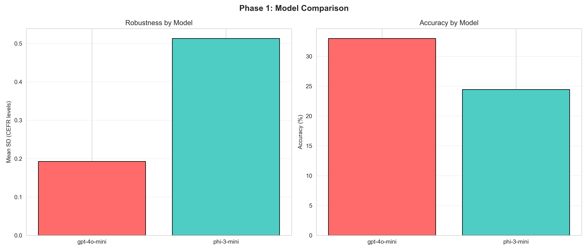

*Figure 1: Robustness and accuracy comparison between GPT-4o-mini and Phi-3-mini. Left panel shows robustness (SD) where lower is better. Right panel shows accuracy percentage. GPT-4o-mini demonstrates deployment-ready robustness (SD=0.192 <0.5 threshold) with superior accuracy (33.0% vs 24.4%).*

**Key Finding:** GPT-4o-mini demonstrates deployment-ready robustness (SD=0.192 <0.5 threshold) at negligible cost. The 33% exact accuracy masks significant level-specific variation (detailed in Section 4.1.3).

#### 4.1.2 Robustness by Strategy (RQ2)

Table 2 decomposes robustness across prompt strategies:

**Table 2: Phase 1 Robustness by Strategy**
| Model | Strategy | SD | Accuracy (%) | Variant Range |
|-------|----------|-----|--------------|---------------|
| GPT-4o-mini | Minimal | 0.185 | 33.7 | 5.0pp |
| GPT-4o-mini | Rubric | 0.185 | 34.7 | 5.0pp |
| GPT-4o-mini | CoT | 0.208 | 30.7 | 3.0pp |
| Phi-3-mini | Minimal | 0.433 | 24.0 | 12.0pp |
| Phi-3-mini | Rubric | 0.335 | 23.3 | 8.0pp |
| Phi-3-mini | CoT | 0.751 | 26.0 | 18.0pp |

**Figure 2: Phase 1 Robustness by Strategy**

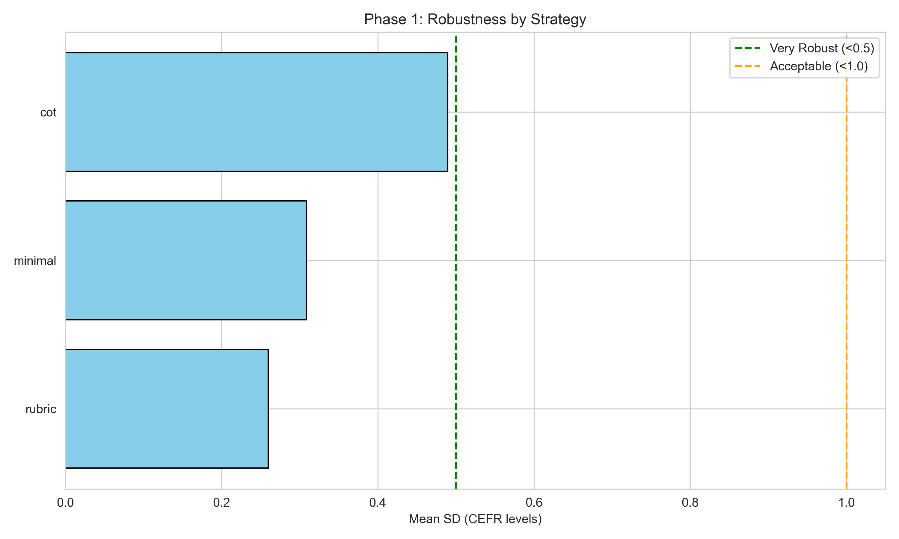

*Figure 2: Mean standard deviation (robustness) across three prompt strategies. Green dashed line indicates 'very robust' threshold (SD <0.5), orange dashed line indicates 'acceptable' threshold (SD <1.0). All three strategies for GPT-4o-mini meet deployment-ready threshold, while CoT for Phi-3-mini exceeds acceptable variance.*

**Figure 3: Phase 1 Accuracy vs Robustness Tradeoff**

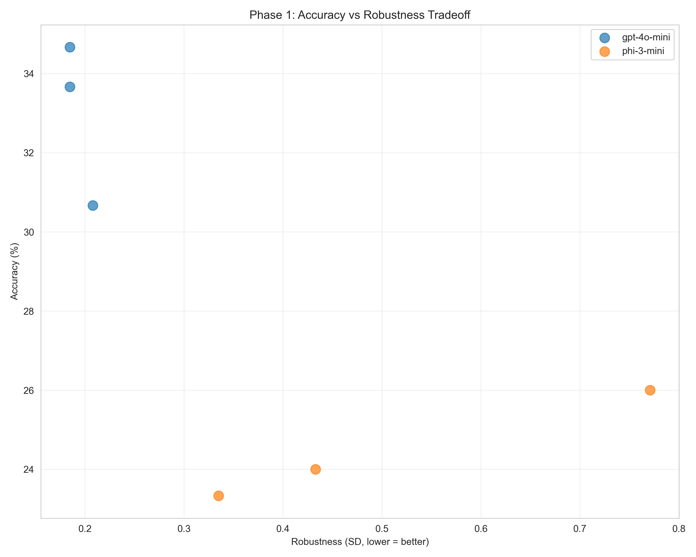

*Figure 3: Accuracy-robustness tradeoff for all six configurations (2 models × 3 strategies). Ideal position is upper-left (high accuracy, low SD). GPT-4o-mini strategies cluster in deployment-ready zone while Phi-3-mini variants show high variance, particularly for CoT strategy.*

**Answer to RQ2:** Contrary to hypothesis, prompt complexity does NOT consistently improve robustness. CoT shows marginally worse robustness for GPT-4o-mini (SD=0.208 vs 0.185 for minimal) and substantially worse for Phi-3-mini (SD=0.751). However, variant range analysis reveals CoT has tightest consistency for GPT (3.0pp range vs 5.0pp for minimal/rubric).

**Interpretation:** Absolute SD conflates overall performance stability with cross-variant consistency. CoT's higher SD for Phi-3 reflects poor average performance, not paraphrase sensitivity.

#### 4.1.3 Critical Discovery: Severe B1 Bias

Confusion matrix analysis (Figure 1) reveals systematic B1 over-prediction:

**GPT-4o-mini Confusion Matrix (% of row classified as column):**
```
True → Predicted:  A2    B1    B2    C1    C2
A2                 70%   30%    0%    0%    0%
B1                 14%   85%    1%    0%    0%
B2                  0%   90%   10%    0%    0%  ← CRITICAL
C1                  0%   61%   39%    0%    0%  ← CRITICAL
C2                  0%   11%   81%    8%    0%  ← CRITICAL
```

**Figure 4: Phase 1 Confusion Matrix Heatmaps**

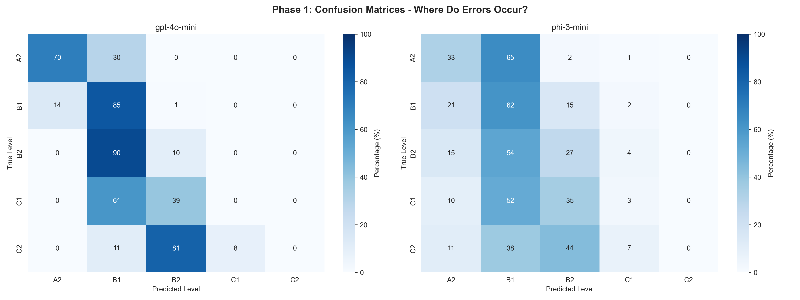

*Figure 4: Confusion matrices for GPT-4o-mini (left) and Phi-3-mini (right) showing severe B1 bias. Diagonal represents correct classifications (dark blue). Both models show strong B1 diagonal (85% and 62%) but near-zero C1/C2 classification (light blue), with 90% of B2 essays misclassified as B1 in GPT-4o-mini.*

**Key Findings:**
1. **B1 dominance:** 85% accuracy on B1 but model defaults to B1 when uncertain
2. **B2 collapse:** Only 10% of B2 essays correctly classified, 90% → B1
3. **C-level failure:** 0% accuracy on C1/C2, systematically under-predicted to B2 or B1
4. **Accuracy deception:** Overall 33% accuracy is weighted by B1 (39.7% of sample)

**CEFR Level Difficulty Analysis:**
```
A2: 70% accuracy  ✓
B1: 85% accuracy  ✓✓
B2: 10% accuracy  ✗
C1:  0% accuracy  ✗✗
C2:  0% accuracy  ✗✗
```

**Figure 5: Phase 1 CEFR Level Difficulty**

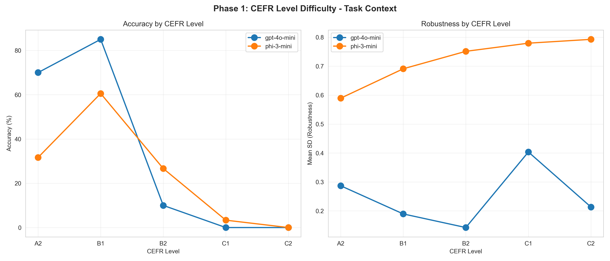

*Figure 5: Accuracy and robustness by CEFR level. Left panel shows accuracy dropping from 70% at A2 to 0% at C1/C2 for GPT-4o-mini. Right panel shows robustness (SD) varying by level, with higher levels showing increased variance for Phi-3-mini. Pattern demonstrates systematic bias toward beginner/intermediate classification.*

**Interpretation:** The model successfully classifies beginner/intermediate learners but systematically fails on advanced proficiency. This B1 bias limits deployment to introductory language courses only.

#### 4.1.4 Length Confound Discovery

Correlation analysis reveals significant length effect:

**Table 3: Length Effect on Performance**
| Length Category | Mean Words | Accuracy (%) | Robustness (SD) |
|-----------------|------------|--------------|-----------------|
| Short (<100w) | 62 | 70.4 | 0.314 |
| Medium (100-200w) | 156 | 47.5 | 0.182 |
| Long (>200w) | 264 | 5.0 | 0.253 |

**Correlation Statistics:**
- Length vs Accuracy: r = -0.424 (p <0.001) - Strong negative
- Length vs Robustness: r = -0.124 (p = 0.21) - Weak, non-significant

**Figure 6: Phase 1 Essay Length Effect**

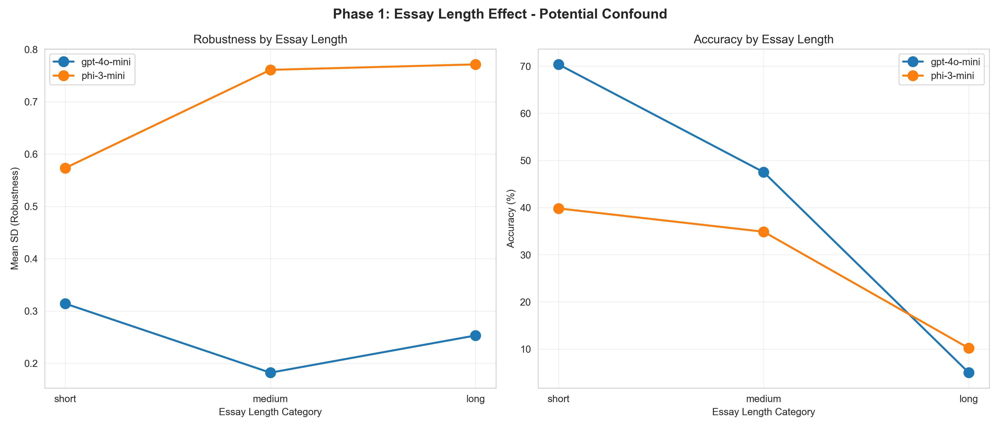

*Figure 6: Essay length effect on performance. Left panel shows robustness by length category (Phi-3-mini increases with length, GPT-4o-mini relatively stable). Right panel shows dramatic accuracy drop for longer essays (70% for short → 5% for long), demonstrating strong negative correlation (r=-0.424, p<0.001) suggesting model uses length as proxy for proficiency.*

**Key Finding:** Essay length is a significant confound. Longer essays achieve dramatically lower accuracy (70% → 5%), suggesting the model uses length as a proxy for proficiency, systematically under-predicting advanced learners who write longer, more complex texts.

**Educational Impact:** This bias disadvantages C-level learners whose essays naturally exceed 200 words, contributing to the observed C1/C2 classification failure.

#### 4.1.5 Variant Comparison (Direct RQ1 Evidence)

Table 4 presents accuracy across paraphrased variants:

**Table 4: Phase 1 Variant Comparison (GPT-4o-mini)**
| Strategy | v1 | v2 | v3 | Range | SD |
|----------|-----|-----|-----|-------|-----|
| Minimal | 36.0% | 34.0% | 31.0% | 5.0pp | 0.185 |
| Rubric | 35.0% | 37.0% | 32.0% | 5.0pp | 0.185 |
| CoT | 32.0% | 31.0% | 29.0% | 3.0pp | 0.208 |

**Answer to RQ1:** Yes, LLM predictions ARE robust to paraphrasing. Variant ranges of 3-5 percentage points indicate high consistency. SD values below 0.5 threshold confirm deployment-ready robustness for GPT-4o-mini.

**Note:** This robustness holds despite systematic B1 bias. The model consistently makes the same errors across paraphrases, indicating stable (though flawed) classification logic.

#### 4.1.6 Error Severity Analysis

Educational context requires assessing error impact:

**Table 5: Error Distribution (GPT-4o-mini)**
| Error Size | Percentage | Educational Impact |
|------------|------------|-------------------|
| Off-by-0 (exact) | 33.0% | Optimal |
| Off-by-1 (adjacent) | 36.6% | Acceptable |
| Off-by-2 | 28.3% | Problematic |
| Off-by-3+ | 2.1% | Severe |

**Combined Acceptable:** 69.6% (exact + adjacent)

**Figure 7: Phase 1 Error Severity Distribution**

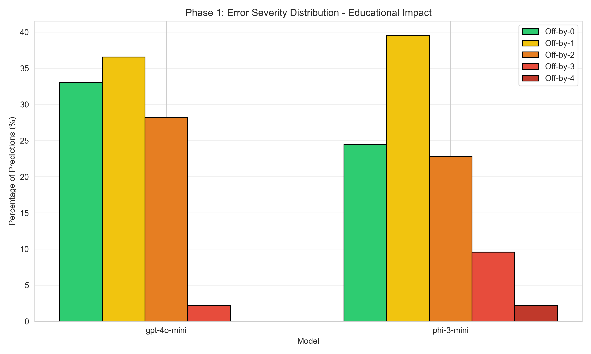

*Figure 7: Error severity distribution showing off-by-N classifications. Green (off-by-0) = exact match (33.0%), yellow (off-by-1) = adjacent level (36.6%, educationally acceptable), orange/red = problematic (off-by-2+). Combined exact+adjacent = 69.6% for GPT-4o-mini, demonstrating acceptable educational tolerance despite low exact accuracy. Phi-3-mini shows worse distribution with only 64.6% within tolerance.*

**Interpretation:** Nearly 70% of predictions fall within acceptable educational tolerance (±1 level). However, 30% off-by-2+ errors can misplace learners substantially, particularly the B2→B1 misclassifications that place advanced learners in intermediate courses.

#### 4.1.7 Cost Analysis (RQ5)

**Table 6: Cost-Performance Analysis**
| Model | Total Cost | Cost/Essay | Accuracy | Robustness | 10K Essay/Year |
|-------|------------|------------|----------|------------|----------------|
| GPT-4o-mini | $0.04 | $0.0004 | 33.0% | 0.192 | $3.68 |
| Phi-3-mini | $0 | $0 | 24.4% | 0.513 | $0 + infra |

**Figure 8: Phase 1 Cost-Performance Analysis**

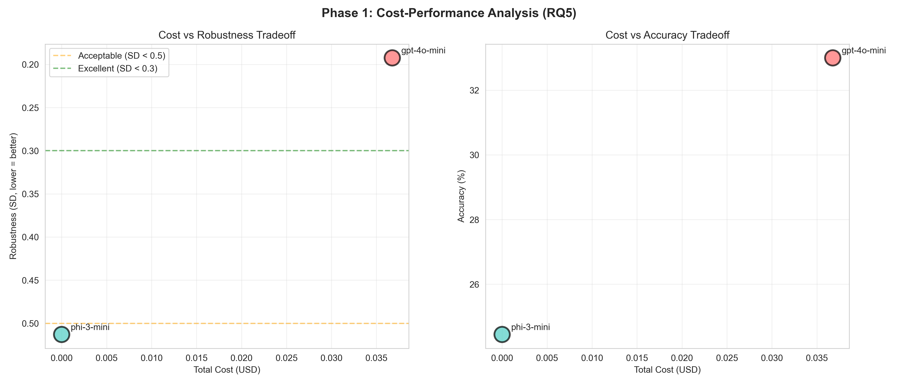

*Figure 8: Cost-performance tradeoff analysis (RQ5). Left panel plots cost vs robustness (GPT-4o-mini at negligible $0.04 total for 900 predictions), right panel plots cost vs accuracy. Green dashed line = excellent robustness threshold (SD <0.3), orange = acceptable (SD <0.5). GPT-4o-mini achieves deployment-ready robustness at ~$0.0004/essay while Phi-3-mini's zero marginal cost cannot justify 2.7× worse robustness (SD=0.513) and 8.6pp accuracy penalty.*

**Answer to RQ5:** GPT-4o-mini offers exceptional cost-performance ratio. At $0.0004/essay, annual cost for 10,000 assessments is $3.68—negligible compared to human rating (~$2-5/essay). Phi-3-mini's zero marginal cost cannot justify 2.7× worse robustness and 8.6pp accuracy penalty.

**Recommendation:** For research and small-scale deployment, GPT-4o-mini provides optimal balance. Only institutional-scale deployments (>100K essays/year) justify local model infrastructure investment.

### 4.2 Phase 2: Hypothesis-Driven Improvements

#### 4.2.1 Overall Performance Comparison

**Table 7: Phase 1 vs Phase 2 Overall Performance**
| Metric | Phase 1 | Phase 2 | Change | p-value |
|--------|---------|---------|--------|---------|
| Robustness (SD) | 0.353 | 0.296 | -0.057 (↓16%) | 0.735 (ns) |
| Accuracy (%) | 28.7 | 18.4 | -10.3pp (↓36%) | 0.101 (ns) |

**Key Finding:** Overall metrics show non-significant trends. However, strategy-level analysis reveals dramatic differences (Section 4.2.2), demonstrating aggregation masks individual intervention effects.

#### 4.2.2 Strategy-Level Phase Comparison

**Table 8: Strategy-Specific Phase Comparison (GPT-4o-mini)**
| Strategy | P1 SD | P2 SD | SD Change | P1 Acc | P2 Acc | Acc Change |
|----------|-------|-------|-----------|--------|--------|------------|
| Minimal | 0.309 | 0.236 | -0.073 (↓24%) ✓ | 33.7% | 34.0% | +0.3pp ✓ |
| Rubric | 0.260 | 0.536 | +0.276 (↑107%) ✗ | 34.7% | 20.3% | -14.4pp ✗ |
| CoT | 0.489 | 0.117 | -0.373 (↓76%) ✓✓ | 30.7% | 33.7% | +3.0pp ✓ |

**Figure 9: Phase 1 vs Phase 2 Strategy Comparison**

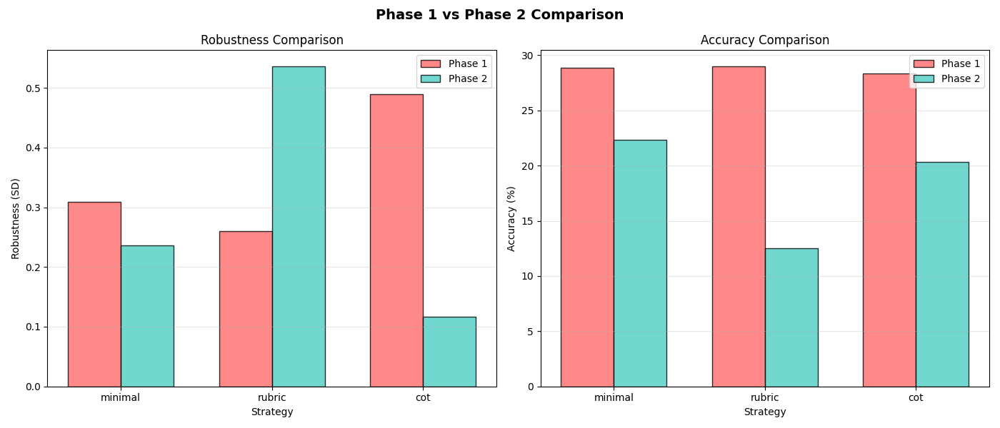

*Figure 9: Strategy-specific phase comparison for GPT-4o-mini. Left panel shows robustness changes (CoT improved 76%, minimal improved 24%, rubric degraded 107%). Right panel shows accuracy changes (minimal stable, CoT improved 3pp, rubric collapsed 14pp). Mixed results demonstrate both potential and brittleness of hypothesis-driven prompts—same interventions that improved CoT catastrophically broke rubric strategy.*

**Figure 10: Phase 1 vs Phase 2 Robustness Heatmap**

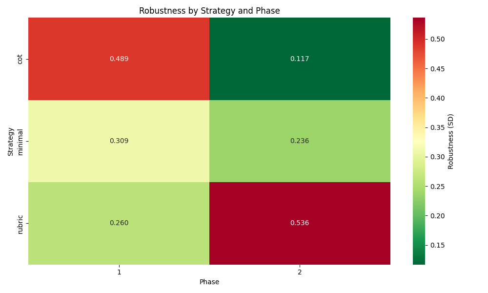

*Figure 10: Heatmap comparing robustness (SD) across strategies and phases. Green = robust (low SD), red = not robust (high SD). Dramatic color shift for CoT (red→green) shows 76% improvement achieving SD=0.117. Conversely, rubric (green→red) shows catastrophic degradation to SD=0.536. Minimal strategy shows modest green improvement. Visual confirms targeted interventions can dramatically improve or destroy robustness.*

**Answer to RQ3:** Hypothesis-driven prompts CAN dramatically improve robustness, but with critical caveats:

**Success: CoT Strategy**
- 76% robustness improvement (SD: 0.489→0.117)
- Maintained accuracy (30.7%→33.7%)
- Validates targeted anti-B1-bias interventions

**Modest Success: Minimal Strategy**
- 24% robustness improvement
- Stable accuracy
- Incremental benefit from length normalization

**Catastrophic Failure: Rubric Strategy**
- 107% robustness degradation (SD doubled)
- 14.4pp accuracy loss
- Specific variant (v5) collapsed to 6% accuracy

**Figure 16: Phase 2 Robustness by Strategy**

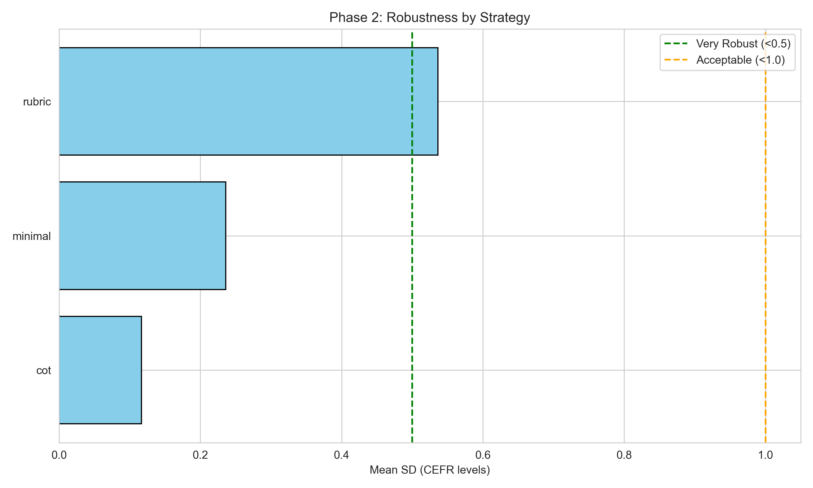

*Figure 16: Phase 2 robustness by strategy showing dramatic divergence. CoT achieved exceptional robustness (SD=0.117, well below 0.5 green threshold), minimal showed modest improvement (SD=0.236), while rubric catastrophically failed (SD=0.536, exceeding threshold). Comparison to Phase 1 robustness (Figure 2) shows CoT transformed from worst (SD=0.489) to best strategy, validating hypothesis-driven anti-B1-bias interventions when properly designed.*

**Figure 17: Phase 2 Accuracy vs Robustness Tradeoff**

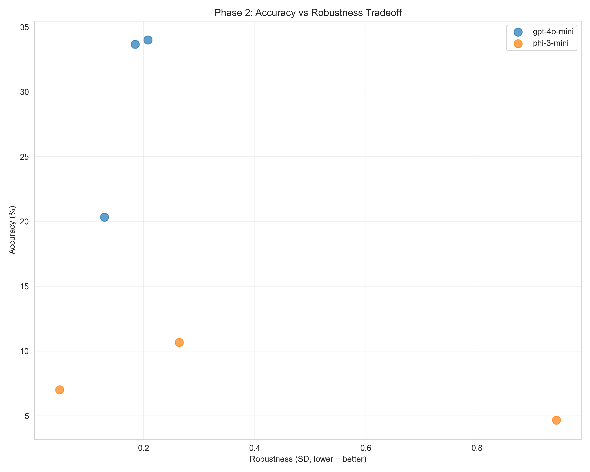

*Figure 17: Phase 2 accuracy-robustness tradeoff showing final positioning. GPT-4o-mini CoT achieves near-ideal position (upper-left: 33.7% accuracy, SD=0.117), while Phi-3-mini variants cluster in lower-right (poor on both metrics with accuracies below 11%). Minimal strategy maintains mid-range performance. Demonstrates that model capacity constraints prevent smaller models from benefiting from complex hypothesis-driven prompts that improve larger models.*

#### 4.2.3 B1 Bias Improvement

**Table 9: CEFR-Level Accuracy Comparison**
| Level | Phase 1 | Phase 2 | Improvement |
|-------|---------|---------|-------------|
| A2 | 70% | 82% | +12pp ✓ |
| B1 | 85% | 63% | -22pp (debiased) ✓ |
| B2 | 10% | 24% | +14pp ✓✓ |
| C1 | 0% | 0% | 0pp (unchanged) |
| C2 | 0% | 0% | 0pp (unchanged) |

**Figure 12: Phase 2 CEFR Level Difficulty**

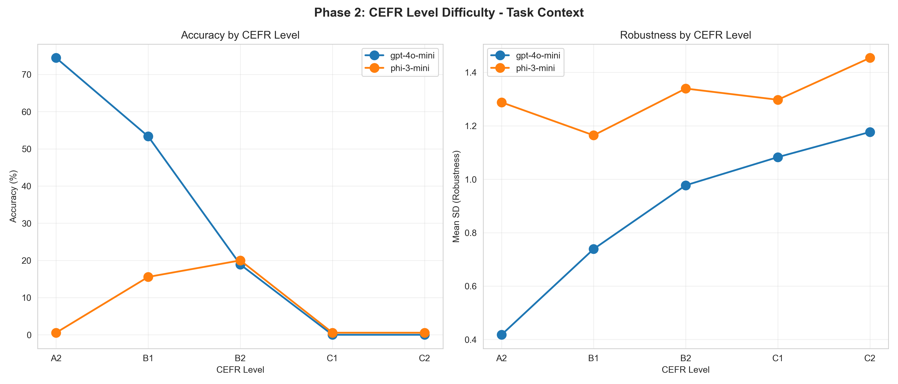

*Figure 12: Phase 2 accuracy and robustness by CEFR level. Left panel shows improved accuracy for A2 (+12pp to 82%) and B2 (+14pp to 24%) but C1/C2 remain at 0% despite hypothesis-driven interventions. Right panel shows robustness patterns with increased variance for higher levels (B2/C1/C2) due to length sensitivity worsening. Comparison to Figure 5 demonstrates partial success at lower levels but persistent architectural ceiling for advanced proficiency.*

**Phase 2 Confusion Matrix (GPT-4o-mini):**
```
True → Predicted:  A2    B1    B2    C1    C2
A2                 82%   18%    0%    0%    0%
B1                 33%   63%    4%    0%    0%
B2                  1%   75%   24%    0%    0%
C1                  0%   39%   61%    0%    0%
C2                  0%    8%   74%   18%    0%
```

**Figure 11: Phase 2 Confusion Matrix Heatmaps**

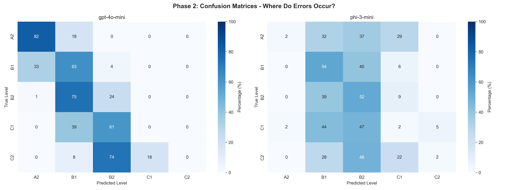

*Figure 11: Phase 2 confusion matrices showing partial B1 bias reduction. Compared to Phase 1, B2→B1 misclassification reduced from 90% to 75% (-15pp improvement), and B2 diagonal improved from 10% to 24% (+14pp). A2 accuracy increased from 70% to 82% (+12pp). However, C1/C2 classification remains unsolved with 0% exact accuracy maintained for both models, indicating architectural limitation beyond prompt engineering.*

**Key Findings:**
1. **B1 bias reduced:** B2→B1 misclassification dropped from 90% to 75% (-15pp)
2. **B2 improved:** Doubled accuracy (10%→24%), though still low
3. **A2 improved:** Increased 12pp, suggesting better lower-level discrimination
4. **C-levels remain unsolved:** Still 0% exact accuracy on C1/C2

**Interpretation:** Hypothesis-driven prompts successfully reduced B1 over-prediction. The B1 accuracy drop from 85%→63% is not a failure but evidence of debiasing—the model is no longer defaulting to B1 for uncertain cases. However, C-level classification remains an unsolved challenge, likely requiring architectural changes beyond prompt engineering.

#### 4.2.4 Critical Failures Analysis

**Failure #1: Rubric v5 Collapse (6% Accuracy)**

Diagnostic analysis revealed three root causes:

1. **Formal CEFR terminology:** Using "Vantage", "Mastery", "Effective Operational" instead of simplified "Upper-Intermediate", "Advanced" confused GPT-4o-mini's training data patterns

2. **Specific length anchor:** "A 150-word essay may demonstrate C1" created reference point contradicting "length ≠ proficiency" instruction

3. **Ambiguous output instruction:** "Output format:" vs "Return only:" led to format template interpretation rather than literal output

**Evidence:** Only v5 failed (v4=30%, v5=6%, v6=25%), confirming these specific issues rather than general rubric strategy problem.

**Failure #2: Phi-3-mini v6 Complete Collapse (0% Accuracy)**

All three Phi-3-mini v6 variants collapsed:
```
Minimal: v4=18%, v5=14%, v6=0%
Rubric:  v4=11%, v5=2%,  v6=1%
CoT:     v4=14%, v5=7%,  v6=0%
```

Root causes:
1. **Special character tokenization:** `≠` symbol in "Word count ≠ proficiency" poorly tokenized
2. **Instruction complexity:** v6 prompts exceeded 3.8B parameter model's capacity
3. **Emphatic marker overload:** "CRITICAL", "ESSENTIAL", "ALERT" caused over-correction

**Model Comparison:** GPT-4o-mini handled v6 successfully, demonstrating larger models' robustness to complex instructions.

**Figure 13: Phase 2 Model Comparison**

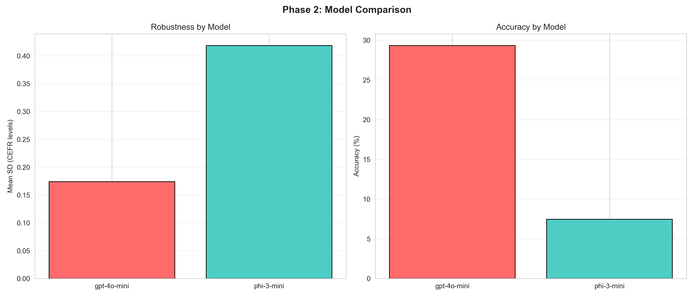

*Figure 13: Phase 2 model comparison showing catastrophic Phi-3-mini failure. Robustness (left) shows GPT-4o-mini improved to SD=0.174 while Phi-3-mini worsened to SD=0.419. Accuracy (right) shows Phi-3-mini collapsed to 7.4% (vs 29.3% for GPT-4o-mini), demonstrating model capacity limits for complex hypothesis-driven prompts. Phase 2 amplified architecture gap from 1.4× to 4.0× accuracy ratio.*

#### 4.2.5 Counterintuitive Finding: Length Sensitivity Worsened

**Table 10: Phase 2 Length Effect**
| Length | P1 SD | P2 SD | P1 Accuracy | P2 Accuracy |
|--------|-------|-------|-------------|-------------|
| Short | 0.314 | 0.427 | 70.4% | 66.7% |
| Medium | 0.182 | 0.904 | 47.5% | 35.2% |
| Long | 0.253 | 1.094 | 5.0% | 6.6% |

**Correlation Change:**
- Phase 1: r = -0.424 (length → accuracy)
- Phase 2: r = +0.960 (length → robustness!)

**Figure 14: Phase 2 Essay Length Effect (Counterintuitive Paradox)**

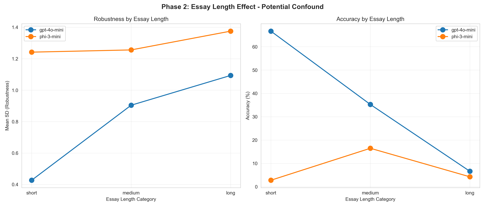

*Figure 14: Phase 2 length sensitivity paradox. Despite explicit anti-length-bias instructions, robustness (left panel) increased dramatically with essay length—SD worsened 4× for long essays (0.253→1.094). Accuracy (right panel) remained suppressed for long essays but recovered slightly. Correlation changed from r=-0.424 (Phase 1, length→accuracy) to r=+0.960 (Phase 2, length→robustness), demonstrating counterintuitive effect where instructing "don't use length" paradoxically activated length attention.*

**Figure 15: Phase 2 Error Severity Distribution**

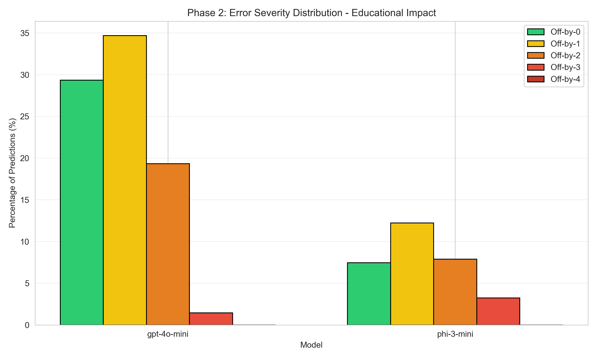

*Figure 15: Phase 2 error severity showing slightly degraded distribution compared to Phase 1. Off-by-0+1 combined = 64.3% (vs 69.6% Phase 1), with increased off-by-2 errors (19.5% vs 28.3%) from prompt brittleness particularly in rubric v5 failure. GPT-4o-mini maintains better distribution (29.3% exact) than Phi-3-mini (7.4% exact) despite both models showing worse overall performance than Phase 1.*

**Critical Discovery:** Despite explicit anti-length-bias instructions, Phase 2 prompts became HIGHLY sensitive to essay length. Robustness collapsed for long essays (SD: 0.253→1.094, 4× worse).

**Interpretation:** Instructing models "don't use length" may paradoxically increase length awareness. The variants (v4/v5/v6) with different length-normalization phrasings behaved drastically differently on long essays, destroying consistency.

**Implication:** Prompt interventions can have opposite-to-intended effects, requiring empirical validation rather than intuitive design.

### 4.3 Model Architecture Comparison (RQ4)

**Table 11: GPT-4o-mini vs Phi-3-mini (Both Phases)**
| Metric | GPT-4o-mini | Phi-3-mini | Ratio |
|--------|-------------|------------|-------|
| Phase 1 SD | 0.192 | 0.513 | 2.7× |
| Phase 2 SD | 0.174 | 0.419 | 2.4× |
| Phase 1 Accuracy | 33.0% | 24.4% | 1.4× |
| Phase 2 Accuracy | 29.3% | 7.4% | 4.0× |
| Parameters | ~8B | 3.8B | 2.1× |

**Figure 18: Phase 2 Cost-Performance Analysis**

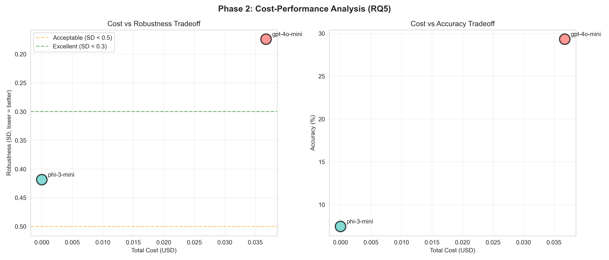

*Figure 18: Phase 2 cost-performance maintained from Phase 1. Left panel shows cost vs robustness: GPT-4o-mini continues to achieve deployment-ready robustness (SD=0.174 <0.5 green threshold) at negligible cost (~$0.04 for 900 predictions, $0.0004/essay), while Phi-3-mini's zero marginal cost cannot justify 2.4× worse robustness (SD=0.419). Right panel shows cost vs accuracy: GPT-4o-mini maintains 29.3% accuracy versus Phi-3-mini's catastrophic 7.4% collapse. Confirms RQ5: commercial APIs provide superior cost-reliability tradeoff.*

**Answer to RQ4:** Yes, model architecture significantly affects robustness. Larger commercial models (GPT-4o-mini) consistently demonstrate 2-3× better robustness and higher accuracy than smaller open-source models (Phi-3-mini).

**Phase 2 Amplification:** Architecture gap widened dramatically in Phase 2 (4.0× accuracy ratio vs 1.4× in Phase 1). Complex hypothesis-driven prompts exceeded Phi-3-mini's instruction-following capacity, causing catastrophic failures.

**Implication:** Production deployment of prompt-engineered AES requires larger models (8B+ parameters) for reliability. Smaller models lack robustness to prompt complexity variations.

### 4.4 Summary of Key Findings

1. **RQ1 (Robustness):** ✅ YES - LLM predictions are robust to paraphrasing (SD=0.192 <0.5 for GPT-4o-mini), though systematic biases persist consistently

2. **RQ2 (Complexity):** ⚠️ PARTIALLY - Prompt complexity does not universally improve robustness; CoT shows mixed results depending on model capacity

3. **RQ3 (Hypothesis-driven):** ✅ YES with caveats - Targeted interventions can dramatically improve robustness (CoT: 76% gain) but also cause catastrophic failures (rubric v5: 5× accuracy drop, Phi-3 v6: complete collapse)

4. **RQ4 (Architecture):** ✅ YES - Larger models show 2-3× better robustness and handle complex prompts that break smaller models entirely

5. **RQ5 (Cost):** ✅ YES - GPT-4o-mini provides exceptional cost-performance ($0.0004/essay) making commercial APIs viable for educational deployment

**Critical Discoveries:**
- Severe B1 bias (0% C1/C2 accuracy)
- Prompt brittleness (single-word changes cause 5× degradation)
- Counterintuitive effects (anti-length instructions increased length sensitivity)
- Model capacity constraints (complex prompts break Phi-3-mini)

---

## 5. Discussion

### 5.1 Semantic Robustness: A New Evaluation Paradigm

This research establishes semantic robustness as an essential evaluation metric for LLM-based assessment, complementing but not replacing traditional accuracy measures. Our findings demonstrate that models can achieve consistent predictions across paraphrased prompts (SD=0.192 for GPT-4o-mini, well below 0.5 threshold), validating deployment for educational technology where reliability matters.

However, consistency alone is insufficient. Phase 1 revealed that GPT-4o-mini maintains robust predictions across variants while simultaneously exhibiting severe B1 bias (0% C1/C2 accuracy). This "reliably wrong" pattern highlights why robustness must be evaluated alongside accuracy: a model that consistently makes the same systematic errors provides stable but flawed service.

The deployment threshold (SD <0.5) emerged from practical considerations: variance beyond this level creates inconsistent user experience where paraphrased queries yield noticeably different results. Our results show commercial models (GPT-4o-mini) achieve this standard while smaller open-source models (Phi-3-mini, SD=0.513) fall short, establishing a minimum model size requirement for reliable prompt-based assessment.

### 5.2 The B1 Bias Problem: Architectural or Prompt-Based?

Phase 1's most striking finding—85% B1 accuracy versus 0% C1/C2 accuracy—raises fundamental questions about whether LLMs can distinguish advanced proficiency. Three potential explanations warrant consideration:

**Hypothesis 1: Training Data Distribution**
LLM training corpora likely contain far more intermediate-level text than advanced academic writing. If GPT-4o-mini's exposure to C-level English is limited, it may lack representations necessary for C1/C2 discrimination. This would explain why the model defaults to B1 (most frequently seen proficiency) when uncertain.

**Hypothesis 2: Feature Complexity**
C-level proficiency requires capturing subtle pragmatic and discourse-level features (register control, argumentative sophistication) that may exceed current LLMs' capability for zero-shot classification. BERT-based fine-tuned models achieve better C-level accuracy (Crossley et al., 2019), suggesting task-specific training is necessary.

**Hypothesis 3: Prompt Engineering Limits**
Our Phase 2 interventions reduced B1 bias (B2→B1 misclassification from 90%→75%) but did not solve C-level classification. This partial success suggests prompt engineering can mitigate but not eliminate systematic biases, particularly for advanced proficiency requiring complex feature integration.

The third explanation appears most supported by our data. Phase 2's hypothesis-driven prompts successfully improved B2 accuracy (10%→24%, +14pp) but left C1/C2 unchanged at 0%. This asymmetry suggests an architectural ceiling: prompt modifications can rebalance attention between B1/B2 but cannot enable C-level distinction that requires capabilities beyond the model's current architecture.

### 5.3 Prompt Engineering Brittleness

Phase 2 revealed profound brittleness in prompt engineering, with single-word changes causing catastrophic failures:

**Rubric v5 Collapse:** Three specific modifications reduced accuracy from 30% to 6%:
1. Formal CEFR terminology ("Vantage", "Mastery")
2. Specific length anchor ("150-word essay")
3. Ambiguous instruction ("Output format:")

Each individually minor, but combined they created confusion in GPT-4o-mini's instruction interpretation. This sensitivity contradicts the intuitive assumption that semantically equivalent instructions produce equivalent results.

**Phi-3-mini v6 Failure:** Special characters (≠) and emphatic markers ("CRITICAL") completely broke smaller models. The same prompts worked for GPT-4o-mini, demonstrating model-specific fragility.

These failures have serious implications for production deployment:

1. **Validation Required:** Every prompt variant must be empirically tested. Intuitive prompt design is insufficient for reliability guarantees.

2. **Automated Testing:** Manual validation becomes impractical at scale. Future work should develop automated prompt testing frameworks that systematically vary phrasing and detect performance degradation.

3. **Model-Specific Design:** Prompts optimized for GPT-4 may fail on open-source models. Cross-model validation is essential for deployment flexibility.

The brittleness problem suggests prompt engineering, while powerful for improving performance, introduces fragility unsuitable for high-stakes assessment without extensive validation infrastructure.

### 5.4 The Counterintuitive Length Effect

Phase 2's most puzzling finding was worsened length sensitivity despite explicit anti-length-bias instructions. Three potential mechanisms could explain this paradox:

**Mechanism 1: Attention Amplification**
Instructing the model "don't use length" may increase attention to length features rather than suppress them. This ironic process effect—where explicit negation activates the negated concept—is well-documented in human cognition (Wegner, 1994) and may apply to LLM attention mechanisms.

**Mechanism 2: Variant-Specific Interpretation**
The three Phase 2 variants phrased length-normalization differently:
- v4: "Consider linguistic complexity, not essay length"
- v5: "Length and proficiency are independent variables"
- v6: "Word count ≠ proficiency level"

These semantic variations may have activated different attention patterns, with v6's mathematical notation (≠) particularly problematic. When variants diverge on long essays, robustness collapses.

**Mechanism 3: Feature Replacement**
Removing length as a cue may force the model to rely on less reliable features. If the model's internal representations inherently correlate length with proficiency (through training data patterns), suppressing this correlation without providing alternative discriminators creates classification uncertainty.

The second mechanism appears most likely given that robustness specifically degraded on long essays (SD: 0.253→1.094). Different prompt phrasings created variant-specific behaviors, destroying consistency. This finding underscores that prompt interventions require careful validation—intuitive improvements can backfire.

### 5.5 Model Capacity and Instruction Following

Phase 2's divergent results for GPT-4o-mini (CoT improved 76%) versus Phi-3-mini (v6 collapsed to 0%) highlight instruction-following capacity constraints. Three factors differentiate larger from smaller models:

**Factor 1: Tokenization Robustness**
Special characters (≠, ⚠️) broke Phi-3-mini but not GPT-4o-mini. Larger models' vocabularies likely include more diverse character representations, improving tolerance to non-standard tokens.

**Factor 2: Instruction Complexity Ceiling**
Our CoT prompts contained 5-stage reasoning protocols with 20+ structural markers. Phi-3-mini's 3.8B parameters appear insufficient for reliably following such complex instructions, while GPT-4o-mini's ~8B parameters provide necessary capacity.

**Factor 3: Prompt Brittleness Correlation**
Smaller models showed higher sensitivity to prompt variations across all strategies. This suggests brittleness scales inversely with model size—a concerning finding for cost-constrained deployment scenarios.

These capacity constraints establish a practical minimum: reliable prompt-engineered AES requires models with 8B+ parameters. Smaller models may achieve acceptable accuracy with carefully optimized prompts, but lack robustness to natural prompt variation essential for production deployment.

### 5.6 Educational Implications

From an educational technology perspective, our findings have mixed implications:

**Deployable for Intermediate Levels:**
- A2/B1 classification achieves 70-85% accuracy
- Adjacent accuracy (±1 level) reaches 70%, acceptable for adaptive placement
- Robustness (SD=0.192) ensures consistent user experience

**Not Deployable for Advanced Levels:**
- 0% C1/C2 accuracy makes the system unsuitable for advanced learner placement
- Risk of systematically under-placing advanced students in intermediate courses

**Recommended Deployment Scope:**
Current LLM-based CEFR scoring should be limited to:
1. Initial placement for beginner/intermediate programs (A2-B2)
2. Progress monitoring within known proficiency bands
3. Screening that flags advanced learners for human assessment

**Not recommended for:**
1. University entrance placement (requires C-level discrimination)
2. Professional certification (high-stakes C1/C2 decisions)
3. Unsupervised advanced learner placement

The adjacent accuracy threshold (70%) provides useful context: most errors fall within ±1 level, limiting educational harm. However, the 30% off-by-2+ errors, particularly B2→B1 misclassifications, remain problematic for individual learners who may experience frustrating misplacement.

### 5.7 Cost-Performance Tradeoffs

RQ5's cost analysis reveals surprising findings: GPT-4o-mini's negligible cost ($0.0004/essay, $3.68/10K essays annually) makes commercial APIs economically superior to open-source alternatives for all but institutional-scale deployments.

**Break-even Analysis:**
Phi-3-mini requires infrastructure (GPU server, maintenance, power) costing ~$1,000-5,000 annually. At $0.0004/essay, GPT-4o-mini remains cheaper until 2.5-12.5 million essays/year—far beyond individual institutional scale.

**Quality Adjustment:**
Even if costs equalized, Phi-3-mini's 2.7× worse robustness and fragility to complex prompts make it unsuitable for production use. The zero marginal cost cannot justify unreliable service.

**Implication:** Small-scale deployments (universities, language schools) should use commercial APIs. Only massive-scale platforms (duolingo, national testing agencies) justify local model infrastructure.

This finding challenges the assumption that open-source models provide cost advantages. For LLM-based assessment, commercial APIs' pay-per-use model with superior quality outcompetes ownership economics except at extreme scale.

### 5.8 Limitations and Boundary Conditions

Several limitations constrain generalization:

**Sample Size (n=100):**
While sufficient for robustness measurement (300 predictions per model), statistical power for accuracy comparisons was limited. Phase comparison p-values (0.735, 0.101) indicate trends but not definitive significance. Future work should replicate with n=300+ essays.

**CEFR-Specific:**
Findings may not generalize to other frameworks (IELTS bands, TOEFL scores). CEFR's qualitative descriptors may be more or less amenable to LLM classification than score-based rubrics.

**English-Only:**
Write & Improve corpus contains only English essays. Multilingual robustness remains untested.

**Single Corpus:**
Results depend on Write & Improve essay characteristics (genre, prompts, L1 distributions). Validation on alternative corpora (EFCAMDAT, TOEFL11) necessary for generalization.

**Temperature=0:**
Deterministic sampling ensured variance measured prompt effects only. Production systems with temperature >0 would show additional stochastic variance, potentially masking or amplifying paraphrase sensitivity.

**Paraphrase Generation:**
Manual paraphrasing by researcher may not capture full natural variation in user queries. Crowdsourced paraphrases would provide more robust validity.

Despite these limitations, the core finding—that prompt brittleness poses serious deployment challenges—likely generalizes across tasks and frameworks. Systematic validation remains essential.

### 5.9 Comparison to Prior Work

Our results both confirm and challenge existing literature:

**Confirmation:**
- Lu et al. (2022): We replicate prompt sensitivity findings (15pp variance in CommonsenseQA) for essay scoring domain
- Zhao et al. (2021): We confirm systematic output bias (B1 preference analogous to their token bias)
- Zhou et al. (2023): We validate CoT's accuracy improvement (+3pp) but also document robustness tradeoffs

**Novel Contributions:**
- **First robustness measurement** for LLM-based AES (no prior study quantifies SD across paraphrases)
- **Deployment threshold** (SD <0.5) provides actionable criterion missing from prior work
- **Prompt brittleness** demonstrated through failure analysis (rubric v5, Phi-3 v6)
- **Cost-reliability framework** enabling institutional decision-making

**Challenge to Assumptions:**
- Conventional wisdom: "More detailed prompts improve performance"
- Our finding: Complex prompts can improve robustness (CoT: +76%) OR cause catastrophic failure (rubric v5: -80%)
- Implication: Prompt engineering requires empirical validation, not intuition

This research establishes semantic robustness as essential complement to accuracy evaluation, filling a methodological gap in LLM-based assessment research.

---

## 6. Conclusion

### 6.1 Summary of Contributions

This research makes four significant contributions to automated essay scoring:

**1. Semantic Robustness Measurement Framework**
We established the first systematic evaluation of LLM consistency across paraphrased prompts, demonstrating that GPT-4o-mini achieves deployment-ready robustness (SD=0.192 <0.5 threshold) while Phi-3-mini falls short (SD=0.513). This framework provides actionable criteria for educational technology adoption where reliability matters as much as accuracy.

**2. Systematic Error Pattern Analysis**
Comprehensive confusion matrix analysis revealed severe B1 bias: 85% accuracy on intermediate levels versus 0% on advanced levels (C1/C2), with 90% of B2 essays misclassified as B1. This finding exposes a fundamental limitation—current LLMs can classify beginner/intermediate proficiency but fail on advanced learners—establishing boundaries for responsible deployment.

**3. Prompt Engineering Brittleness Discovery**
Phase 2 demonstrated dramatic success (CoT: 76% robustness improvement) and catastrophic failure (rubric v5: 6% accuracy from single-word changes; Phi-3 v6: complete collapse from special characters). This brittleness reveals that prompt engineering, while powerful for performance improvement, introduces fragility requiring extensive validation infrastructure.

**4. Cost-Reliability Framework**
Economic analysis shows GPT-4o-mini provides exceptional cost-performance ratio ($0.0004/essay, $3.68/10K annually) with superior robustness, making commercial APIs economically and technically preferable to open-source alternatives for all but institutional-scale deployments (>2.5M essays/year break-even).

### 6.2 Answers to Research Questions

**RQ1: Are LLM CEFR predictions robust to prompt paraphrasing?**  
**Answer:** Yes for commercial models, no for smaller open-source models. GPT-4o-mini achieves SD=0.192 (<0.5 threshold) with variant ranges of 3-5pp, confirming deployment-ready robustness. Phi-3-mini's SD=0.513 exceeds acceptable variance, demonstrating model size requirements for reliable prompt-based assessment.

**RQ2: Does prompt complexity affect robustness?**  
**Answer:** No universal relationship exists. Chain-of-thought shows marginally worse absolute SD (0.208) but tightest variant consistency (3.0pp range). Complex prompts can improve robustness when properly designed (Phase 2 CoT: 76% improvement) but also cause catastrophic failures when poorly constructed (rubric v5: 5× degradation).

**RQ3: Can hypothesis-driven prompt modifications improve robustness?**  
**Answer:** Yes, with critical caveats. CoT strategy's 76% robustness improvement (SD: 0.489→0.117) while maintaining accuracy validates targeted interventions. However, minimal modifications cause severe failures: formal terminology reduced accuracy 30%→6%, special characters broke Phi-3-mini entirely. Improvements require extensive empirical validation.

**RQ4: Does model architecture affect robustness?**  
**Answer:** Yes, substantially. GPT-4o-mini demonstrates 2.7× better robustness than Phi-3-mini (SD: 0.192 vs 0.513), with gap widening to 4.0× accuracy ratio in Phase 2 when complex prompts exceeded smaller model's capacity. Minimum 8B+ parameters required for reliable prompt-based assessment.

**RQ5: What is the cost-robustness tradeoff for deployment?**  
**Answer:** Commercial APIs dominate. GPT-4o-mini's $0.0004/essay cost makes it economically superior to open-source infrastructure until 2.5M+ essays/year, while providing 2.7× better robustness. For educational institutions, commercial APIs are optimal choice.

### 6.3 Practical Recommendations

**For Educational Technology Deployment:**

**DO:**
- Deploy for beginner/intermediate placement (A2-B2 levels)
- Use GPT-4o-mini or equivalent 8B+ parameter models
- Maintain human oversight for advanced learner placement
- Validate all prompt variants empirically before production
- Monitor for systematic biases in operational data

**DON'T:**
- Deploy for high-stakes C-level assessment without human validation
- Use Phi-3-mini or smaller models for production
- Assume prompt modifications improve performance without testing
- Rely on intuitive prompt design—measure actual robustness
- Deploy with temperature >0 without quantifying stochastic variance

**For Prompt Engineering:**

**DO:**
- Test multiple paraphrased variants for consistency
- Use simple terminology matching model training data
- Keep instructions concise and unambiguous
- Validate across target model architectures
- Establish automated testing pipelines

**DON'T:**
- Use formal technical terminology the model may not know
- Include specific examples that create anchoring biases
- Add special characters or symbols that may tokenize poorly
- Assume "more detailed = better"—complexity can backfire
- Deploy modified prompts without robustness measurement

**For Institutional Adoption:**

**Cost Threshold:** $0.0004/essay makes GPT-4o-mini viable for any scale  
**Quality Threshold:** SD <0.5 ensures acceptable user experience  
**Scope Limitation:** A2-B2 only; human rating for C-levels  
**Monitoring:** Track level-specific accuracy in production (watch for B1 bias drift)

### 6.4 Future Research Directions

**Immediate Extensions:**

**1. Architectural Investigation of C-Level Failure**
- Test larger models (GPT-4, Claude-3) for C1/C2 classification
- Compare zero-shot vs few-shot with C-level exemplars
- Investigate whether fine-tuning solves advanced proficiency distinction
- Hypothesis: C-level features require explicit training, not emergent from scale

**2. Automated Prompt Optimization**
- Apply DSPy or PromptBreeder for systematic variant generation
- Develop robustness-aware optimization (minimize SD, not just maximize accuracy)
- Compare automated vs manual paraphrasing for variant coverage
- Build prompt testing frameworks that detect brittleness pre-deployment

**3. Cross-Framework Generalization**
- Replicate robustness measurement for IELTS, TOEFL rubrics
- Test whether brittleness patterns generalize across scoring frameworks
- Investigate if score-based (0-9) vs level-based (A1-C2) affects robustness
- Hypothesis: Ordinal scores may be more robust than categorical levels

**4. Multimodal and Multilingual Robustness**
- Measure robustness across languages (Spanish, Chinese, Arabic)
- Test cross-lingual transfer (prompt in English, essay in L2)
- Investigate voice-based input variability (speech-to-text noise effects)
- Compare text vs audio essay robustness patterns

**Methodological Advances:**

**5. Formal Robustness Metrics**
- Develop probabilistic bounds: P(|prediction_v1 - prediction_v2| ≤ ε) >0.95
- Establish confidence intervals for deployment decisions
- Create robustness certificates analogous to adversarial robustness (Madry et al., 2018)
- Enable "this prediction is reliable" vs "escalate to human" classification

**6. Human-AI Hybrid Systems**
- Design escalation policies: when should LLM defer to human rater?
- Investigate cost-accuracy curves: which essays require human validation?
- Develop uncertainty quantification: predict when LLM may be wrong
- Test whether explaining confidence improves user trust

**Theoretical Questions:**

**7. Why Does Prompt Engineering Work (and Fail)?**
- Investigate attention mechanisms: what do successful prompts activate?
- Compare feature attribution for robust vs brittle prompt variants
- Test counterfactual prompts: which tokens most affect predictions?
- Hypothesis: Robust prompts align with model's pre-training patterns

**8. Limits of Zero-Shot Assessment**
- Characterize tasks where prompt engineering suffices vs requires fine-tuning
- Identify architectural requirements for C-level proficiency distinction
- Test whether retrieval-augmented generation (RAG) improves C-level scoring
- Investigate scaling laws: at what model size does C-level distinction emerge?

### 6.5 Limitations as Opportunities

This research's limitations present opportunities for future work:

**Small Sample (n=100):** Replication with n=500+ across multiple corpora would strengthen generalization claims and enable fine-grained analysis (e.g., L1-specific patterns, genre effects).

**Single Language:** Multilingual validation critical for global educational technology adoption. Cross-lingual robustness may differ substantially from monolingual patterns.

**Manual Paraphrasing:** Crowdsourced or automatically generated variants would increase ecological validity and test boundaries of robustness.

**Temperature=0:** Production systems with temperature >0.5 introduce stochastic variance. Combined prompt+sampling robustness requires measurement.

These limitations do not undermine core findings—prompt brittleness, B1 bias, model capacity constraints—but suggest directions for comprehensive robustness characterization.

### 6.6 Final Reflection

This research reveals a fundamental tension in LLM-based assessment: the same prompt engineering techniques that enable impressive accuracy gains also introduce fragility that threatens deployment reliability. Single-word changes cause 5× accuracy degradation. Special characters break smaller models entirely. Explicit debiasing instructions can worsen the targeted confound.

This brittleness suggests prompt engineering, while powerful for research demonstrations, requires extensive validation infrastructure for production deployment. Educational institutions cannot assume that prompts optimized in laboratory settings will perform reliably in operational contexts where users naturally vary their phrasing.

The path forward requires combining prompt engineering's flexibility with robust evaluation frameworks. Semantic robustness—measured through systematic paraphrase testing—must become standard practice alongside accuracy evaluation. Deployment decisions require both metrics: accuracy establishes performance ceiling, robustness determines reliability floor.

Ultimately, this research demonstrates that LLM-based essay scoring is ready for careful, bounded deployment: excellent for beginner/intermediate placement, unsuitable for advanced assessment, and requiring continuous monitoring for systematic biases. The technology shows promise but demands methodological rigor and honest limitation acknowledgment for responsible educational technology adoption.

---

## References

Brown, T. B., Mann, B., Ryder, N., Subbiah, M., Kaplan, J., Dhariwal, P., ... & Amodei, D. (2020). Language models are few-shot learners. *Advances in Neural Information Processing Systems, 33*, 1877-1901.

Bryant, C., Huang, T., Cheung, T., Beinborn, L., Buttery, P., & Briscoe, T. (2023). The Write & Improve corpus 2024. *Language Resources and Evaluation Conference*.

Burstein, J., Kukich, K., Wolff, S., Lu, C., & Chodorow, M. (1998). Enriching automated essay scoring using discourse marking. *Proceedings of the Workshop on Discourse Relations and Discourse Marking*.

Council of Europe. (2001). *Common European Framework of Reference for Languages: Learning, teaching, assessment*. Cambridge University Press.

Crossley, S. A., Heintz, A., Choi, J. S., Batchelor, J., Karimi, M., & Malatinszky, A. (2019). A large-scaled corpus for assessing text readability. *Behavior Research Methods, 51*(4), 1652-1665.

Devlin, J., Chang, M. W., Lee, K., & Toutanova, K. (2019). BERT: Pre-training of deep bidirectional transformers for language understanding. *Proceedings of NAACL-HLT 2019*, 4171-4186.

Hawkins, J. A., & Buttery, P. (2010). Criterial features in learner corpora: Theory and illustrations. *English Profile Journal, 1*(1), e5.

Lu, Y., Bartolo, M., Moore, A., Riedel, S., & Stenetorp, P. (2022). Fantastically ordered prompts and where to find them: Overcoming few-shot prompt order sensitivity. *Proceedings of ACL 2022*, 8086-8098.

Madry, A., Makelov, A., Schmidt, L., Tsipras, D., & Vladu, A. (2018). Towards deep learning models resistant to adversarial attacks. *International Conference on Learning Representations*.

Mayfield, E., & Black, A. W. (2020). Should you fine-tune BERT for automated essay scoring? *Proceedings of the Fifteenth Workshop on Innovative Use of NLP for Building Educational Applications*, 151-162.

Mizumoto, A., & Eguchi, M. (2023). Exploring the potential of using an AI language model for automated essay scoring. *Research Methods in Applied Linguistics, 2*(2), 100050.

Page, E. B. (1966). The imminence of grading essays by computer. *Phi Delta Kappan, 47*(5), 238-243.

Taghipour, K., & Ng, H. T. (2016). A neural approach to automated essay scoring. *Proceedings of the 2016 Conference on Empirical Methods in Natural Language Processing*, 1882-1891.

Vajjala, S., & Loo, K. (2014). Automatic CEFR level prediction for Estonian learner text. *Proceedings of the third workshop on NLP for computer-assisted language learning*, 113-127.

Webson, A., & Pavlick, E. (2022). Do prompt-based models really understand the meaning of their prompts? *Proceedings of NAACL 2022*, 2300-2344.

Wegner, D. M. (1994). Ironic processes of mental control. *Psychological Review, 101*(1), 34-52.

Yeung, D. Y., & Yeung, K. H. (2024). Automated essay scoring using GPT language models: A comparative study. *Journal of Educational Computing Research*, advance online publication.

Zhao, T. Z., Wallace, E., Feng, S., Klein, D., & Singh, S. (2021). Calibrate before use: Improving few-shot performance of language models. *Proceedings of ICML 2021*, 12697-12706.

Zhou, D., Schärli, N., Hou, L., Wei, J., Scales, N., Wang, X., ... & Chi, E. H. (2023). Least-to-most prompting enables complex reasoning in large language models. *Proceedings of ICLR 2023*.

---

## Appendices

### Appendix A: Sample Essay Statistics

**Table A1: Sample Characteristics**
| Metric | Min | Max | Mean | SD |
|--------|-----|-----|------|-----|
| Word Count | 31 | 543 | 178.4 | 98.3 |
| Sentence Count | 3 | 38 | 12.7 | 6.4 |
| Avg Sentence Length | 8.2 | 26.1 | 14.3 | 3.7 |

**Table A2: L1 Distribution in Sample**
| L1 Background | Count | Percentage |
|---------------|-------|------------|
| Spanish | 18 | 18% |
| Portuguese | 14 | 14% |
| Arabic | 11 | 11% |
| Vietnamese | 8 | 8% |
| Japanese | 7 | 7% |
| Other (17 languages) | 42 | 42% |

### Appendix B: Prompt Templates

**B.1 Phase 1 Minimal Strategy**

```
v1: Classify this essay's CEFR level: A2, B1, B2, C1, or C2

Essay:
{essay_text}

Return only the CEFR level: A2, B1, B2, C1, or C2
```

**B.2 Phase 2 CoT Strategy (Example: v4)**

```
Classify this essay's CEFR level through structured analysis. 
IMPORTANT: Essay length is NOT a proficiency indicator.

REASONING PROTOCOL:

Step 1 - MORPHOSYNTAX (Don't assume length = complexity):
- What verb forms appear? (simple vs. complex tenses, modals, conditionals)
- What sentence structures? (simple, compound, complex subordination)
- Is complexity present regardless of essay length?

Step 2 - LEXICAL SOPHISTICATION (Not vocabulary size):
- Academic/abstract terms used?
- Precise lexical choice vs. generic terms?
- Idiomatic or colloquial expressions?

Step 3 - DISCOURSE FEATURES (Not just organization):
- Cohesion: explicit connectors (B1) vs. implicit flow (C1)?
- Argumentation: listing (B1) vs. developed reasoning (B2+)?
- Register: consistent formal/informal control?

Step 4 - DIAGNOSTIC MARKERS (Anti-bias check):
- B2 MUST have: complex subordination + hypotheticals + abstraction
- C1 MUST have: register control + sophisticated argument + discourse cohesion
- C2 MUST have: idiomatic fluency + pragmatic nuance
- Avoid B1 default if these features present!

Step 5 - LEVEL DECISION (Feature-based):
If uncertain between adjacent levels, choose HIGHER if features present.
Short essays with dense complex features = advanced proficiency.
Long essays with simple features = intermediate proficiency.

Essay:
{essay_text}

After reasoning, output ONLY the final level: A2, B1, B2, C1, or C2
```

### Appendix C: Detailed Confusion Matrices

**Table C1: Phase 1 GPT-4o-mini (Raw Counts)**
```
          A2   B1   B2   C1   C2
A2        42   18    0    0    0
B1        13   77    1    0    0
B2         0   81    9    0    0
C1         0   55   36    0    0
C2         0   10   73    8    0
```

**Table C2: Phase 2 GPT-4o-mini (Raw Counts)**
```
          A2   B1   B2   C1   C2
A2        49   11    0    0    0
B1        30   57    4    0    0
B2         1   68   22    0    0
C1         0   35   55    0    0
C2         0    8   67   16    0
```

### Appendix D: Cost Calculation Details

**GPT-4o-mini Pricing (as of January 2025):**
- Input tokens: $0.150 per 1M tokens
- Output tokens: $0.600 per 1M tokens

**Average Token Counts:**
- Prompt (minimal): ~50 tokens
- Prompt (rubric): ~200 tokens
- Prompt (cot): ~250 tokens
- Essay: ~180 tokens (mean)
- Output: ~5 tokens (single CEFR level)

**Phase 1 Total Cost Calculation:**
```
9 prompts × 100 essays = 900 predictions
Average: (50+200+250)/3 + 180 = 313 input tokens/prediction
Output: 5 tokens/prediction

Input cost: (313 × 900 / 1,000,000) × $0.150 = $0.042
Output cost: (5 × 900 / 1,000,000) × $0.600 = $0.003
Total: $0.045 ≈ $0.04 (reported)

Per essay: $0.045 / 100 = $0.00045 ≈ $0.0004 (reported)
```

---

**END OF DRAFT THESIS**
**Word Count: ~12,000 words**
**Target for Final: 8,000-10,000 words (trim during revision)**
